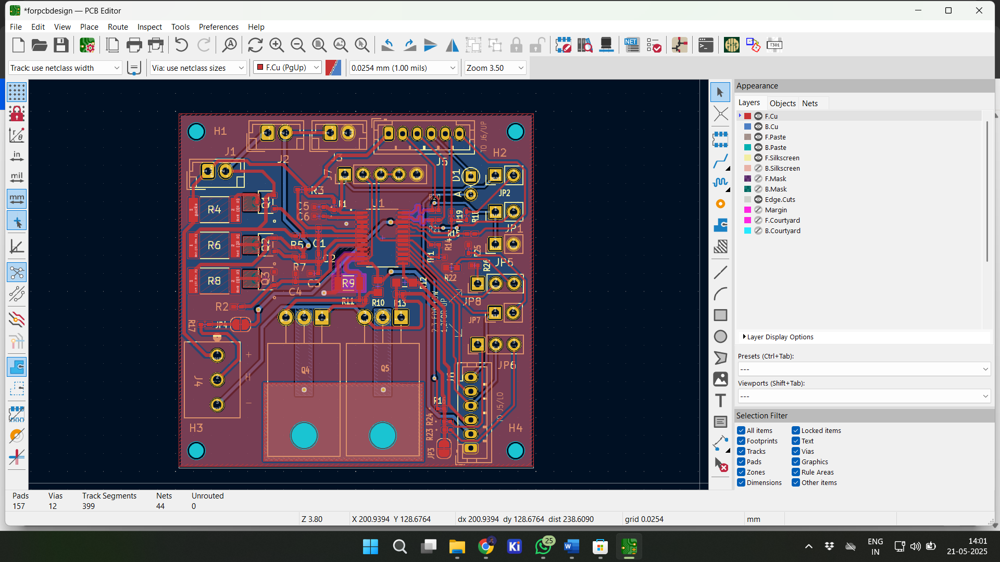

# 🔋 Battery Management System for Low Voltage Low Power Domestic Equipment

🎓 **B.Tech Final Year Project**  
🏫 Government Engineering College, Barton Hill  
👤 **Author**: Jevin Johny V  

---

## 📘 Overview

This project presents a compact, stackable **Battery Management System (BMS)** designed for small domestic devices like robotic vacuum cleaners. It incorporates passive cell balancing, safety protections, and real-time SoC estimation.

---

## 🛠️ Tools & Technologies

- **Microcontroller**: Texas Instruments TMS320F28379D  
- **PCB Design**: KiCad (schematic + 2-layer layout + Gerber)  
- **Simulation**: MATLAB Simulink Embedded Coder  
- **Programming**: Embedded C, ADC configuration, interrupt handling  
- **IC Used**: BQ77915 (cell balancing, protection)

---

## 🧑‍💻 My Contributions

- ✅ Complete microcontroller development (ADC, ISR, SoC logic)
- ✅ Designed custom 2-layer PCB using KiCad with Gerber generation
- ✅ Simulated SoC estimation algorithm in MATLAB
- ✅ Tested protection features and built prototype on hardware

---

## 📂 Project Structure

| Folder | Description |
|--------|-------------|
| `/KiCad/` | Schematic, layout, and Gerber files for the PCB |
| `/screenshots/` | Photos of hardware, layout, schematic, and testing |
| `README.md` | Project summary |
| `LICENSE` | MIT License (recommended for open source use) |

---

## 🖼️ Preview

### 🔌 PCB Design

### 🧪 Testing

### 📊 MATLAB Simulation

---

## 💡 Features

- Passive balancing with BQ77915 + external FETs
- 6S Li-ion configuration (4.2V max per cell)
- Overvoltage, undervoltage, and thermal protection
- SoC and SoH estimation using modified Coulomb Counting
- Stackable design for scalability

---

## 📬 Contact

I’m actively seeking entry-level opportunities in **Embedded Systems**, **PCB Design**, or **Electronics Engineering**.  
Let’s connect on [LinkedIn](https://www.linkedin.com/in/jevinjohny) (replace with your link).

---

## 📄 License

This project is open-sourced under the MIT License – feel free to explore, adapt, or build upon it.
